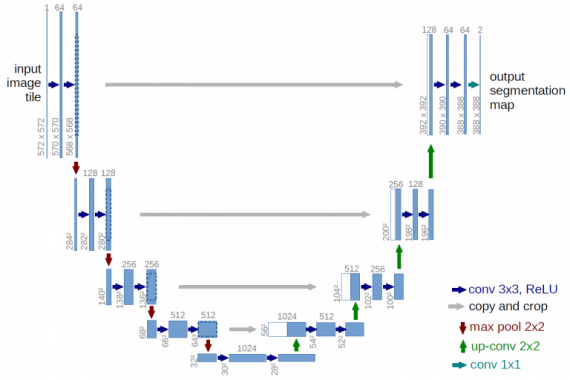

# AviaHackathon2022
## Кейс Геоскан

Команда Zeithgeist

Участники:
 - Пешиков В.Е.
 - Самсонова В.И.
 - Скворцов И.М.
 - Стулов И.С.
 - Чистов В.А.
---
 ## Задача 

Автоматизация таксации лесов:
Выделение крон на ортофотоплане.


Основой для кейса является структура нейронной сети U-net



---
## Основные файлы

```
unet.ipynb - Тренировка нейросети на датасете
avhack.ipynb - Демонстрация работы готовой модели
data/parser.py - Парсер в датасет
```

---
## Датасет

[Готовый датасет](https://drive.google.com/file/d/1AV1BFUOpvXitrfE__K4YvkyNsoN6EE3T/view?usp=sharing)

Работа с парсером данных и подготовка датасета:
  - Разрезать изображения на подходящий размер (128x128, 256x256, 512x512)
  - Разметить изображения с помощью [VGG Annotator](https://www.robots.ox.ac.uk/~vgg/software/via/via.html) или [Makesence.ai](https://www.makesense.ai/)
  - Полученный json и изображения обработать парсером

```python
python ../../main.py --input-json dataset.json --input-folder .
```
Парсер генерирует в своем корне папку dataset с уже готовыми изображениями и масками на каждый объект внутри изображения.

Структура датасета
```
.
├── dataset
│   ├── les10_0
│   │   ├── image
│   │   │   └── les10_0.png
│   │   └── masks
│   │       ├── result0.png
│   │       ├── result10.png
│   │       ├── result11.png
│   │       ├── result12.png
│   │       ├── result1.png
│   │       ├── result2.png
│   │       ├── result3.png
│   │       ├── result4.png
│   │       ├── result5.png
│   │       ├── result6.png
│   │       ├── result7.png
│   │       ├── result8.png
│   │       └── result9.png
│   ├── les10_1
│   │   ├── image
│   │   │   └── les10_1.png
│   │   └── masks
│   │       ├── result0.png
│   │       ├── result10.png
│   │       ├── result11.png
│   │       ├── result12.png
│   │       ├── result1.png
│   │       ├── result2.png
│   │       ├── result3.png
│   │       ├── result4.png
│   │       ├── result5.png
│   │       ├── result6.png
│   │       ├── result7.png
│   │       ├── result8.png
│   │       └── result9.png
...
```

---
## Результары работы

Результатом работы являются размеченные на 2 класса изображения (background, tree)

Оригинал             |  Обработанное
:-------------------------:|:-------------------------:
  |  

---
## Производительность

Спека на котором выполнялись тренировки, тестирование:
- Nvidia 1080ti11Gb
- i5-12500
- RAM 32Gb

Среднее время обработки одного гектара леса: 8 секунд.

---
## Подготовка окружения

```bash
pip install -r requirements.txt
```

```
cuda 11.7
```
### Версии пакетов

```
tensorflow 2.8.0
keras 2.8.0
numpy 1.21.5
scimage 0.19.2
matplotlib 3.5.2
opencv 4.6
```